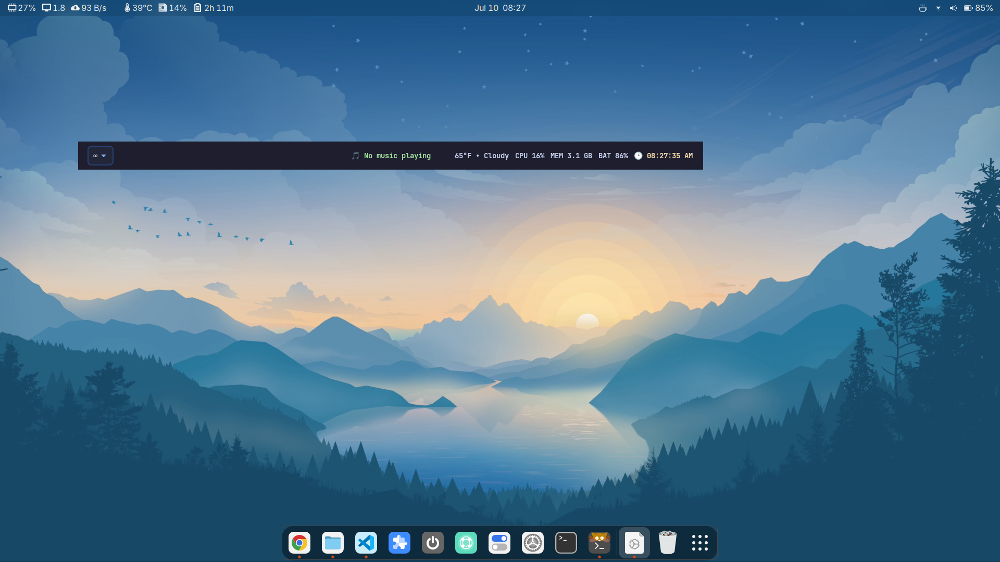
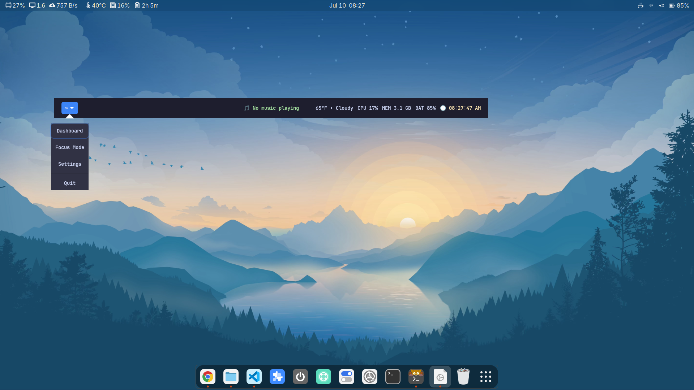
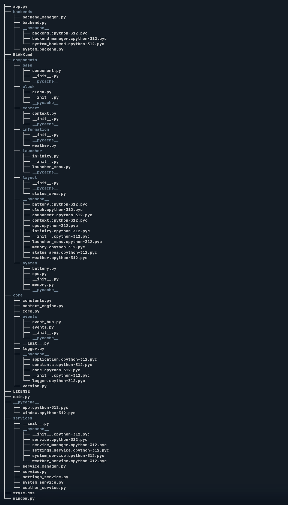
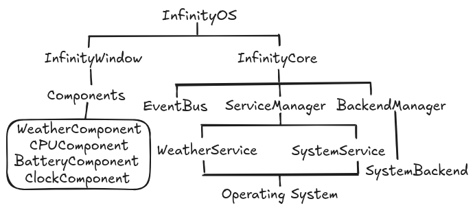

InfinityOS

A context-aware desktop platform built with Python and GTK4.

What is InfinityOS?

InfinityOS is an experimental desktop platform built around one simple idea:

The desktop should understand what you're doing, not just what applications you have open.

Instead of centering the experience around windows and applications, InfinityOS is designed around context. The system surfaces the information and actions most relevant to the user's current task while remaining calm, minimal, and unobtrusive.

InfinityOS is not a Linux distribution.

Its long-term goal is to become a portable desktop platform capable of running across multiple Linux desktop environments while maintaining a consistent, context-aware user experience.

Current Status

Latest Release: Genesis v0.3 — Architectural Foundation

Current features include:

GTK4 Infinity Bar
Event-driven architecture
Service layer
Backend abstraction layer
Weather monitoring
CPU monitoring
Memory monitoring
Battery monitoring
Launcher menu
Centralized logging
Modular component system
Screenshots
Infinity Bar

Project Vision

InfinityOS is an attempt to rethink the desktop from the perspective of context rather than applications.

Traditional desktop environments organize work around windows, icons, and applications. As a result, users spend much of their time managing software instead of focusing on the task they are trying to accomplish.

InfinityOS takes a different approach.

Instead of asking, "What application should I open?", InfinityOS asks:

"What is the user trying to accomplish?"

Every part of the system is designed to understand context and present the most relevant information, actions, and tools at the appropriate time.

The desktop should feel calm, adaptive, and intelligent without becoming distracting or intrusive.

Architecture

InfinityOS follows a layered architecture:

GTK Window
     │
     ▼
 Components
     │
     ▼
 Services
     │
     ▼
 Backends
     │
     ▼
 Operating System

Core principles:

Components never communicate directly.
Services own application logic.
Backends abstract platform-specific functionality.
Communication is event-driven through the EventBus.
Every layer has a single responsibility.
Technologies
Python 3
GTK4
PyGObject
psutil
Project Structure
docs/
src/
components/
services/
core/
backends/
Development Timeline
Genesis v0.1 — Foundation
Initial GTK4 Infinity Bar
Component architecture
Live clock
Initial project structure
Genesis v0.2 — Modular UI
Launcher menu
Context component
Status area
Weather component
Improved styling
Modular UI organization
Genesis v0.3 — Architectural Foundation
EventBus
ServiceManager
BackendManager
Dependency injection
WeatherService
SystemService
SettingsService
Logging framework
CPU monitoring
Memory monitoring
Battery monitoring
Documentation overhaul

Genesis v0.3 completes the architectural foundation of InfinityOS.

Genesis v0.4 (Planned)
Context Engine improvements
Richer launcher
Persistent settings
Desktop integration
Performance improvements
Running InfinityOS

Clone the repository:

git clone https://github.com/supsinfinity/InfinityOS.git

Enter the project:

cd InfinityOS/src/bar

Install dependencies:

pip install psutil

Run:

python3 main.py
Documentation

Documentation is available in the docs/ directory:

ARCHITECTURE.md
CONTRIBUTING.md
DECISIONS.md
DESIGN.md
MANIFESTO.md
PROJECT_STATE.md
TODO.md
VISION.md
Contributing

Contributions, bug reports, and feature suggestions are welcome.

Please read docs/CONTRIBUTING.md before opening a pull request.

License

This project is licensed under the MIT License.
